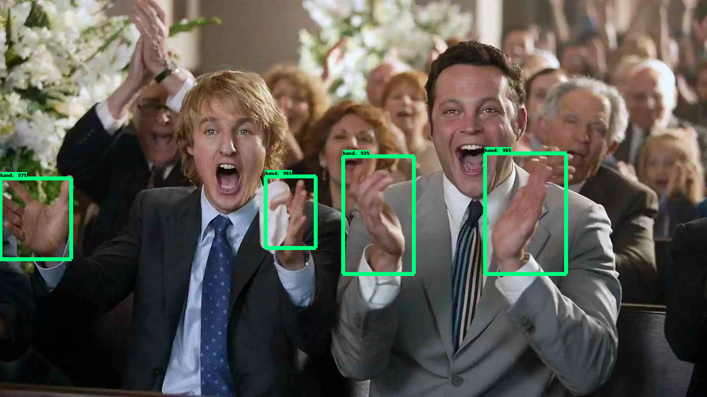

# hand-detection

This project uses faster-rcnn-resnet model to detect and localize hands in an image using GCP ml engine.


## Usage

1. ```pyenv virtualenv 3.6.5 my-virtual-env-3.6.5``` ; create a virtual environment
2. ```pyenv activate my-virtual-env-3.6.5```; activate the virtual environment
3. ```pip install -r requirements.txt```; Install dependencies


## Prerequisites 

1. [Install Tensorflow object detection API](https://github.com/tensorflow/models/blob/master/research/object_detection/g3doc/installation.md). 
2. After installing this you should have a **models/** folder in your project directory. 
3. [Install Docker](https://docs.docker.com/install/)
4. [Install Google Cloud SDK](https://cloud.google.com/sdk/install) 

## Training your own model 

I have used GCP ml engine to train the detection model. 

Note: As soon as your training job would start, it would start incurring charges. 

1. Navigate to ```cd scripts/preprocessing```.
2. Run ```python generate_tf_record.py``` to generate data in TFRecord format. 
3. Navigate to ```cd models/research/```. 
4. Run ```export PYTHONPATH=$PYTHONPATH:`pwd`:`pwd`/slim```
5. Create project on GCP
6. Setup GCP SDK, run ```./google-cloud-sdk/install.sh``` and run ```
./google-cloud-sdk/bin/gcloud init```
7. Create bucket ```gsutil mb -l europe-north1 gs://[BUCKET_NAME]/```
8. Navigate to ```cd detection/``` and run ```bash gcp_deploy.sh [BUCKET_NAME]```
9. All the requires files are now in **[BUCKET_NAME]/data** folder on GCP. 
10. Navigate to ```cd models/research``` and run the following commands in order: 

      1. ```bash object_detection/dataset_tools/create_pycocotools_package.sh /tmp/pycocotools ```
      2. ```python setup.py sdist```
      3. ```cd slim```
      4. ```python setup.py sdist``` 

11. Run  ```bash gcp_run_job.sh [BUCKET_NAME]```. 
12. Monitor training job : ```tensorboard --logdir=gs://[BUCKET_NAME]/train/```

## Deployment 

I used Tensorflow serving to deploy the model using docker. Make sure the models are versioned. Tensorflow serving
by default picks up the model with latest version (highest integer). Our model is versioned under **tf_serving/1**. **1** is the version number. 

Before deploying the model we have to export the model to tensorflow saved format. 

```cd workspace/training_demo```

``` 
python export_inference_graph \
    --input_type encoded_image_string_tensor \
    --pipeline_config_path gs://[BUCKET_NAME]/data/fast_rcnn_resnet101_coco.config \
    --trained_checkpoint_prefix gs://[BUCKET_NAME]/train/model.ckpt \
    --output_directory exported_graphs/
``` 

Now pick the model of your choice and move it to the **tf_serving** folder by running the following command:

```mv exported_graphs/. ../../tf_serving/1/```

Now your model is versioned and we can start with Tensor flow serving.

1. Pull the docker image of tensorflow server : ```docker pull tensorflow/serving```
2. Run docker service : ```docker run -d --name serving_base tensorflow/serving```
3. Copy your model to docker container:  ```docker cp tf_serving/ serving_base:/models/faster_rcnn```
4. Commit changes : ```docker commit --change "ENV MODEL_NAME faster_rcnn" serving_base detection```
5. Start your new container with custom model: ```
docker run -p 8501:8501 --mount type=bind,source=$PWD/tf_serving,target=/models/faster_rcnn -e MODEL_NAME=faster_rcnn -t detection ```
6. Run ```python tf_serving.py IMAGE_PATH```

NOTE : The inference time was 26 seconds on the following CPU:

Macbook Pro (13-inch, 2017), 2.3 GHz Intel Core i5, 8 GB 2133 MHz LPDDR3, Intel Iris Plus Graphics 640 1536 MB
## Results 

I tested the model with some test images. The results are given below: 




## Credits

1. [Tensorflow object detection API](https://github.com/tensorflow/models/tree/master/research/object_detection)
2. [Fast RCNN](http://openaccess.thecvf.com/content_iccv_2015/papers/Girshick_Fast_R-CNN_ICCV_2015_paper.pdf)
3. [Residual Network](https://arxiv.org/abs/1512.03385)
4. [Google Cloud AI Platform](https://cloud.google.com/ml-engine/docs/technical-overview) 
5. [Andrew Ng deep learning specialization](https://www.coursera.org/specializations/deep-learning)

